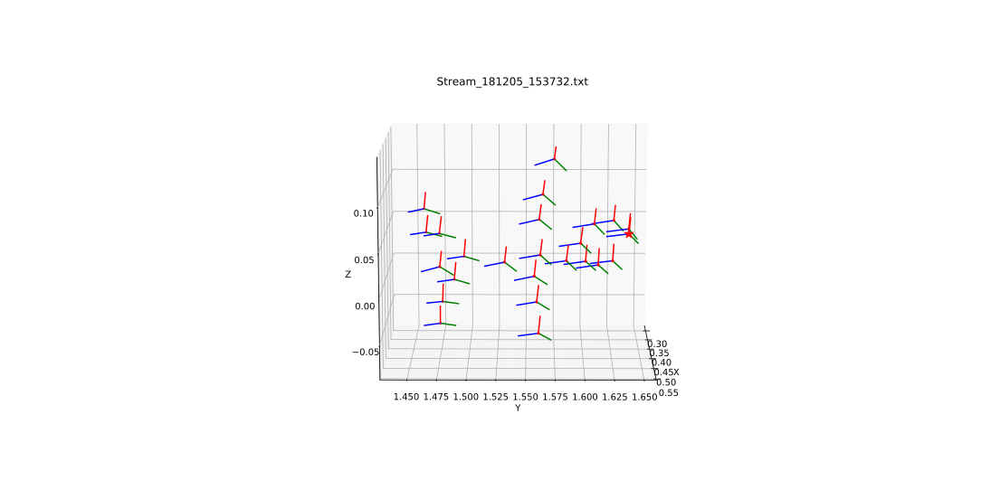

# HW05

## 마크다운 연습 및 6 Dof pose 실습을 정리한 repository입니다

### Fugure_1

6 Dof pose 실습때 탑을 그릴려는 생각으로 만든 것 입니다

위 그림은 6 Dof pose 실습 Fugure_1을 여러 방향에서 본 그림입니다

### Fugure_2

6 Dof pose 실습때 졸라맨을 그릴려는 생각으로 만든 것 입니다

위 그림은 6 Dof pose 실습 Fugure_2을 여러 방향에서 본 그림입니다
